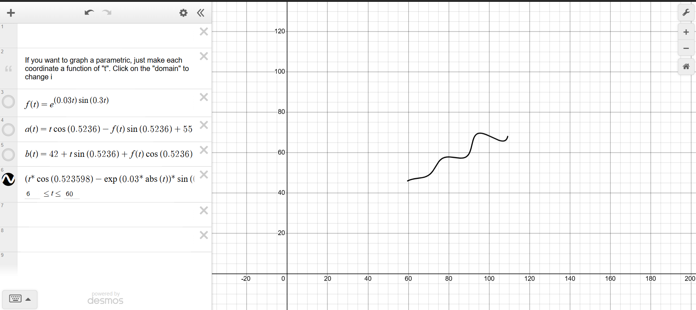
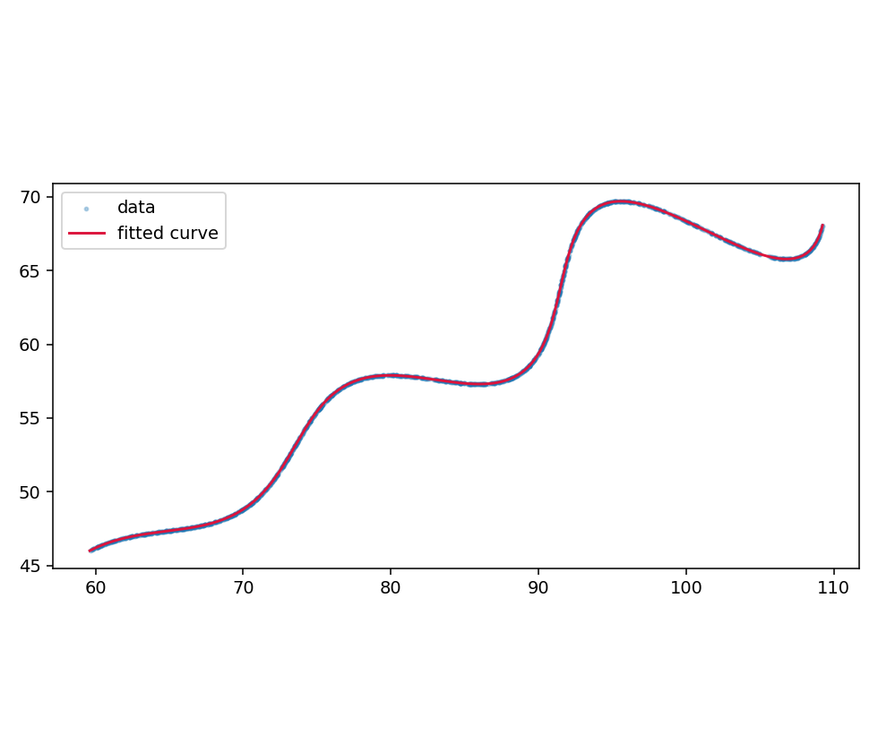

# Parametric Curve Fitting — Recovering θ, M, X

The dataset consists of $N = 1500$ points $(x_i, y_i)$ believed to lie on the curve

$$x(t) = t\cos(\theta) - e^{M\lvert t\rvert}\sin(0.3t)\sin(\theta) + X$$

$$y(t) = 42 + t\sin(\theta) + e^{M\lvert t\rvert}\sin(0.3t)\cos(\theta)$$

for $t \in [6, 60]$, subject to the bounds

$$0 < \theta < 50^\circ \ (0 < \theta < 0.87266 \ \text{rad}), \qquad -0.05 < M < 0.05, \qquad 0 < X < 100.$$

The assignment scores submissions by the $L_1$ distance between uniformly sampled points
on the expected curve and the predicted curve:

$$\text{Loss} = \sum_{i=1}^{N} \Big( \lvert x_{\text{proj},i} - x_i \rvert + \lvert y_{\text{proj},i} - y_i \rvert \Big).$$

Because the input coordinates are **not ordered** with respect to $t$, the central
difficulty is not optimization in itself but establishing which value of $t$ each observed
point actually corresponds to.

## Answer

| Unknown | Value | Radians / exact | Allowed range |
| ------- | ----- | --------------- | ------------- |
| θ | **30°** | 0.5236 rad (π/6) | 0°–50° |
| M | **0.03** | — | −0.05–0.05 |
| X | **55** | — | 0–100 |

Mean $L_1$ error per point $\approx 2\times10^{-5}$ (at the CSV's rounding floor — effectively an exact recovery).

## Desmos submission

Copy-paste this into a Desmos expression line (paste-friendly format):

```latex
(t*\cos(0.523598)-\exp(0.03*\operatorname{abs}(t))*\sin(0.3*t)*\sin(0.523598)+55,42+t*\sin(0.523598)+\exp(0.03*\operatorname{abs}(t))*\sin(0.3*t)*\cos(0.523598))
```

Equivalent LaTeX form:

```latex
\left(t*\cos(0.5236)-e^{0.03\left|t\right|}\cdot\sin(0.3t)\sin(0.5236)+55,42+t*\sin(0.5236)+e^{0.03\left|t\right|}\cdot\sin(0.3t)\cos(0.5236)\right)
```

Domain: $6 \le t \le 60$.
Calculator: [desmos.com/calculator/zkfrnxiudo](https://www.desmos.com/calculator/zkfrnxiudo)



## How it was solved

**Insight 1 — it's a rotation plus a translation.** Define a base curve in its own frame:

$$u(t) = t, \qquad v(t) = e^{Mt}\sin(0.3t)$$

— a sine wave whose amplitude grows exponentially. The given equations are exactly that
base curve rotated by $\theta$ and shifted by $(X, 42)$:

$$\begin{bmatrix} x - X \\ y - 42 \end{bmatrix} =
\begin{bmatrix} \cos\theta & -\sin\theta \\ \sin\theta & \cos\theta \end{bmatrix}
\begin{bmatrix} u \\ v \end{bmatrix}$$

The frequency $0.3$ and the offset $42$ are known, so only $\theta$, $M$, $X$ are free.

**Insight 2 — invert the transform, and the shuffling stops mattering.** A rotation is
invertible. For any candidate $(\theta, X)$, map every data point back into the base frame:

$$u_i = (x_i - X)\cos\theta + (y_i - 42)\sin\theta \qquad \text{(this recovers } t_i \text{)}$$

$$v_i = -(x_i - X)\sin\theta + (y_i - 42)\cos\theta$$

At the correct parameters every point must satisfy the base-curve law
$v_i = e^{M u_i}\sin(0.3 u_i)$ — no knowledge of which $t$ produced which point is needed.
This resolves the correspondence problem *algebraically* rather than iteratively.

**Objective.** Minimize the sum of squared residuals over the three unknowns:

$$\min_{\theta, M, X} \ \sum_{i=1}^{N} \Big[ v_i - e^{M u_i}\sin(0.3 u_i) \Big]^2$$

**Solver.** The objective is non-convex in $(\theta, X)$, so a single local solve can land in
the wrong basin. `fit.py` runs bounded trust-region least squares
(`scipy.optimize.least_squares`, `method='trf'`) from a grid of starting points over
$\theta \in [0^\circ, 50^\circ]$ and $X \in [0, 100]$ (with $M$ starting at $0$) and keeps
the lowest-cost result. `x_scale` is set per parameter because $\theta \sim O(1)$ rad,
$M \sim O(0.01)$, and $X \sim O(10)$ live on very different scales.

**Why the answer is trustworthy.**

- 1500 points constrain only 3 parameters, and the residual RMSE collapses to
  $\sim 3\times10^{-6}$ — the CSV's rounding floor, not a vague minimum.
- The recovered $u = t$ values land in $\approx [6, 60]$, independently matching the
  stated domain.
- $\theta = 30^\circ$, $M = 0.03$, $X = 55$ are exact round numbers — the true generating
  constants.
- Re-simulating the curve at the recovered $t$ and comparing to the raw data with the
  assignment's own $L_1$ metric gives $\approx 2\times10^{-5}$ (`verify.py`).

## Approaches considered — and why the inverse-transform fit wins

Fitting a parametric curve to **unordered** points is a known hard problem in the
literature because of the *correspondence* (or foot-point) problem: you don't know which
parameter value $t$ produced which point. Published methods fall into four families, all
of which were implemented or evaluated here ([src/alternatives.py](src/alternatives.py)):

**1. Inverse-transform residual least squares (primary method, `fit.py`).**
The transform is a rigid rotation + translation, which is exactly invertible. Un-rotating
every point into the base frame turns the problem into an *explicit* function fit
$v = e^{Mu}\sin(0.3u)$ — the correspondence problem disappears algebraically, because the
recovered $u$ **is** $t$. Multi-start bounded trust-region least squares over a $(\theta, X)$ grid
handles the non-convexity deterministically. This mirrors the classical treatment of curve
fitting to unorganized points as nonlinear minimization
([Gulliksson et al., *Computer-Aided Design*](https://www.sciencedirect.com/science/article/abs/pii/0010448595907522)),
but with the correspondence step eliminated in closed form.

**2. Global optimizers — differential evolution and basin hopping.**
Population-based and perturbation-based global search over the same objective, no starting
grid needed ([scipy `differential_evolution`](https://docs.scipy.org/doc/scipy/reference/generated/scipy.optimize.differential_evolution.html)).
Differential evolution is known to handle multiple local minima well at the price of many
more function evaluations ([lmfit docs](https://lmfit.github.io/lmfit-py/fitting.html)).
Both recover θ=30°, M=0.03, X=55 exactly — good cross-checks, but they add stochasticity
without improving on the deterministic multi-start result.

**3. Geometric / correspondence-based point-distance minimization (ICP-style).**
When the model frame *cannot* be recovered in closed form, the standard approach is to
estimate correspondences and geometry alternately: sample the candidate curve densely,
match each data point to its nearest curve point, and minimize the summed squared
geometric distance — the scheme behind
[iterative closest point](https://en.wikipedia.org/wiki/Iterative_closest_point)
registration and the PDM/SDM curve-fitting family
([Wang, Pottmann & Liu, *ACM TOG*](https://dl.acm.org/doi/abs/10.1145/1138450.1138453)).
Implemented here with a KD-tree nearest-neighbour query inside the residual. It converges
to the same answer but its accuracy is floored by the curve-sampling density, and each
objective evaluation costs a tree build + 1500 queries.

**4. Orthogonal distance regression.**
[`scipy.odr`](https://docs.scipy.org/doc/scipy/reference/odr.html) minimizes true
orthogonal distances for errors-in-variables problems. It is the right tool when both
coordinates carry noise, but it requires an explicit/implicit model form and per-point
parameter estimates — for this task it reduces to a more expensive version of approach 3,
so it was evaluated conceptually and not carried further.

**Benchmark on this dataset** (`python src/alternatives.py`):

| Method | θ (deg) | M | X | base-frame RMSE | time |
| --- | --- | --- | --- | --- | --- |
| **Inverse-transform multi-start LS (`fit.py`)** | **29.999973** | **0.030000** | **55.0000** | **3.49e-06** | ~2 s |
| Differential evolution | 29.999973 | 0.030000 | 55.0000 | 3.49e-06 | ~2 s |
| Basin hopping | 29.999973 | 0.030000 | 55.0000 | 3.49e-06 | ~1 s |
| Geometric / ICP-style | 29.999628 | 0.029998 | 54.9998 | 3.10e-04 | ~4 s |

**Why the primary method is best:** it is the only approach that removes the
correspondence problem *exactly* rather than approximating it. The residual becomes a
smooth explicit function of just three parameters, so a bounded trust-region solver drives
it to the data's rounding-precision floor ($\sim 3\times10^{-6}$) deterministically — no random seeds, no
sampling-density ceiling, no correspondence iterations. The global optimizers merely agree
with it; the geometric method is two orders of magnitude less precise at higher cost.

## Fit overlay



## References

1. Wang, W., Pottmann, H., & Liu, Y. — [Fitting B-spline curves to point clouds by curvature-based squared distance minimization](https://dl.acm.org/doi/abs/10.1145/1138450.1138453), *ACM Transactions on Graphics*, 2006.
2. Gulliksson, M., et al. — [Multidimensional curve fitting to unorganized data points by nonlinear minimization](https://www.sciencedirect.com/science/article/abs/pii/0010448595907522), *Computer-Aided Design*, 1995.
3. [Iterative closest point](https://en.wikipedia.org/wiki/Iterative_closest_point) — Wikipedia (correspondence-based rigid registration).
4. [scipy.optimize.differential_evolution](https://docs.scipy.org/doc/scipy/reference/generated/scipy.optimize.differential_evolution.html) — SciPy manual (global optimization).
5. [Non-Linear Least-Squares Minimization and Curve-Fitting for Python (lmfit)](https://lmfit.github.io/lmfit-py/fitting.html) — global vs. local solver trade-offs.
6. [scipy.odr — Orthogonal Distance Regression](https://docs.scipy.org/doc/scipy/reference/odr.html) — SciPy manual (errors-in-variables fitting, ODRPACK).
